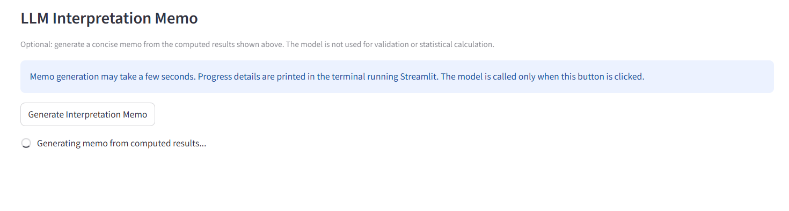
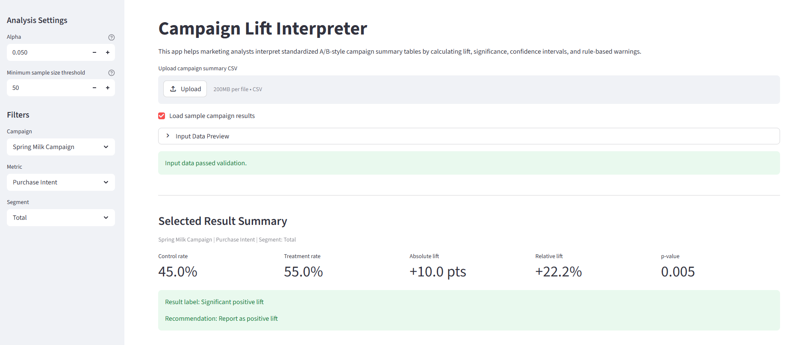
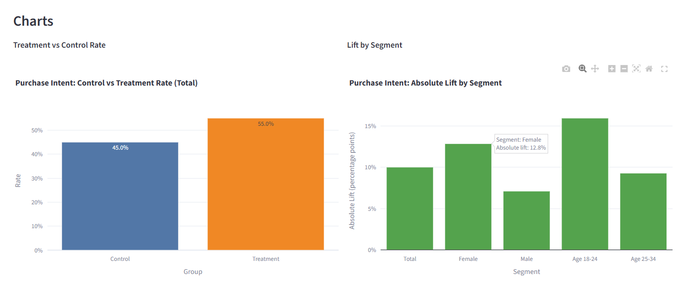
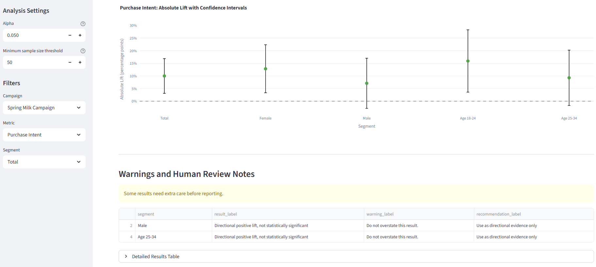
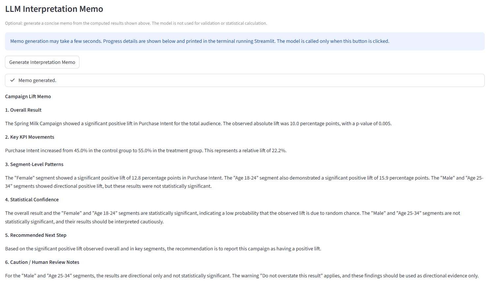

# Campaign Lift Interpreter

## Project Context

Campaign Lift Interpreter is a Streamlit app for junior marketing analysts who need to interpret standardized A/B-style campaign test summaries. The app supports a common reporting workflow: an analyst receives a summary table, checks whether Treatment outperformed Control, reviews statistical confidence, and prepares a short business interpretation.

The app does not process raw respondent-level survey data and does not try to be a general marketing analytics assistant. It focuses on one repeatable task: interpreting campaign lift from a standardized summary-level CSV.

## What the App Does

The app workflow is:

1. Upload a CSV file or load the included sample data.
2. Validate the input structure and values.
3. Calculate treatment/control rates, absolute lift, relative lift, p-values, and confidence intervals.
4. Apply deterministic rule-based labels and warnings.
5. Display summary cards, charts, warnings, and a detailed results table.
6. Optionally generate a concise interpretation memo from the computed results.

## Why Generative AI Is Useful Here

Generative AI is not used for statistics in this project. Python performs validation, calculations, labels, and chart generation.

The LLM is used only after the calculations are complete. Its role is to turn computed outputs into a readable analyst memo. This helps a junior analyst explain results clearly while keeping the memo grounded in deterministic Python outputs.

## Input Format

The required CSV columns are:

```csv
campaign,metric,segment,group,n,success
```

Example row:

```csv
Spring Milk Campaign,Purchase Intent,Total,Control,400,180
```

Each campaign + metric + segment combination must have exactly one `Control` row and one `Treatment` row. Extra columns are ignored.

## System Design

- `app.py`: Streamlit dashboard, file loading, filters, summary display, warnings, tables, charts, and optional memo button.
- `src/validation.py`: validates required columns, numeric values, groups, duplicates, and Control/Treatment pairing.
- `src/calculations.py`: calculates rates, lift, p-values, z-scores, standard errors, and confidence intervals.
- `src/labels.py`: applies deterministic result labels, warnings, and recommendations.
- `src/charts.py`: creates Plotly charts for rate comparison, lift by segment, and confidence intervals.
- `src/memo_generator.py`: optionally calls Gemini using `google-genai` and sends only computed/labeled results.
- `prompts/campaign_memo_prompt.md`: prompt that constrains the memo to computed results and cautious interpretation.

## Artifact Snapshot

The app provides a compact workflow for turning a standardized campaign summary CSV into an interpretation-ready dashboard and memo.

### 1. Upload or Load Sample Data

The user can upload a campaign summary CSV or load the included sample file.



### 2. Selected Result Summary

After validation and calculation, the app shows the selected campaign, metric, and segment with key statistics such as control rate, treatment rate, absolute lift, relative lift, and p-value.



### 3. Charts

The app visualizes Treatment vs Control rate, lift by segment, and confidence intervals.





### 4. LLM Interpretation Memo

The optional memo feature generates a concise analyst-facing interpretation based only on computed results.



### Example Input

```
csv
campaign,metric,segment,group,n,success
Spring Milk Campaign,Purchase Intent,Total,Control,400,180
Spring Milk Campaign,Purchase Intent,Total,Treatment,400,220
```

## Baseline Comparison and Evaluation Results

### Baseline Workflow

The baseline is a spreadsheet-based workflow. In this workflow, a junior analyst manually prepares the summary table, calculates control and treatment rates, calculates lift, checks statistical significance manually or skips it, creates charts, and writes a short memo.

This baseline is realistic because campaign lift results are often reviewed in Excel or Google Sheets before being turned into a report. However, the manual workflow can be inconsistent. Analysts may forget to check sample size, overstate directional results, or write a memo that does not clearly separate statistically significant findings from directional-only patterns.

### Evaluation Design

I evaluated the app against this spreadsheet baseline using two standardized CSV files:

| Test file | Purpose | Expected behavior |
|---|---|---|
| `data/sample_campaign_results.csv` | Main demo case with clear positive and directional campaign effects | The app should calculate lift correctly, identify significant positive results, visualize segment patterns, and generate a grounded memo. |
| `data/evaluation_edge_cases.csv` | Edge-case file with small samples, weak effects, negative directional effects, and mixed segment results | The app should flag risky results, avoid overstating weak findings, and show where human review is needed. |

The evaluation used five criteria:

| Criterion | What I checked |
|---|---|
| Calculation correctness | Whether rates, lift, p-values, and confidence intervals were calculated consistently from the summary data. |
| Visualization usefulness | Whether the charts made treatment/control differences, segment patterns, and uncertainty easier to inspect. |
| Memo faithfulness | Whether the LLM memo stayed grounded in computed results instead of inventing unsupported findings. |
| Decision caution | Whether the app separated statistically significant results from directional or risky results. |
| Actionability | Whether the output helped an analyst decide what could be reported and what needed further review. |

### Findings

The app performed best when the input followed the standardized summary-level format. Compared with the spreadsheet baseline, it made the workflow more consistent by combining validation, lift calculation, confidence intervals, rule-based warnings, charts, and memo generation in one place.

For the main sample file, the app correctly highlighted a significant positive lift in Purchase Intent and showed which segments were statistically significant versus directional only. The charts made the segment-level pattern easier to understand than a raw spreadsheet table.

For the edge-case file, the app was useful because it did not treat every positive or negative movement as a strong finding. Small samples and non-significant results were flagged for caution, which supports the human review requirement.

The main limitation is that the app does not replace analyst judgment. It does not process raw survey data, verify the original research design, or prove causality. The LLM memo is useful as a first-draft interpretation, but a human analyst still needs to review sample quality, test design, and business context before using the result in a final report.

## Setup

```bash
pip install -r requirements.txt
```

## API Key Setup

The dashboard works without an API key. Without a key, validation, calculations, charts, warnings, and tables still run. Only the optional LLM memo is unavailable.

The memo feature requires one of these environment variables:

```bash
GOOGLE_API_KEY
GEMINI_API_KEY
```

The app first checks system environment variables. If neither key exists, it tries a local `.env` file. The `.env` file should not be committed. `.env.example` is only a template.

## Run the App

```bash
python -m streamlit run app.py
```

## Limitations and Human Review

- The app only supports standardized summary-level CSVs.
- It does not process raw respondent-level survey data.
- It does not prove causality unless the underlying test design supports that claim.
- The LLM memo is a first-draft interpretation, not a final report.
- Human analysts should review sample quality, test design, audience definitions, and business context before reporting results.
